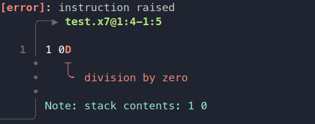

## Raises
x7's namesake and one of its most standout features. Here's how to use them.

### Instructions used in this chapter
| Symbol | Name | Brief |
:-: | - | -
`r` | raise            | Raise.
`e` | except           | Try to run a given block, falling back to a different one if it raises.
`s` | suppress         | Ignore raises in a certain block.
`m` | mask             | Mask raises in a block, protecting them from one layer of being caught.
`!` | invert           | Logical NOT for raising.
`<` | less than        | Compare two values, expecting `first < second`.
`G` | not less than    | Compare two values, expecting `first >= second`.
`=` | equal to         | Compare two values, expecting `first == second`.
`/` | not equal to     | Compare two values, expecting `first != second`.
`>` | greater than     | Compare two values, expecting `first > second`.
`L` | not greater than | Compare two values, expecting `first <= second`.
`l` | lift             | Run separate blocks on the same arguments and push both the results.

### Intro
Raises happen all the time in x7 for all sorts of reasons. Some of them will be familiar from other languages, while others may seem strange because of x7's exclusive use of raises as control flow.

Here are some examples of cases that raise:
- Type errors, like trying to add a pair to a number
- Taking more values from the stack than it has
- Division by zero
- Reading an unassigned variable
- Explicitly raising with `r`
- Failed comparisons

When an instruction raises and it isn't caught by anything, a message is written to stderr explaining where the raise occurred and why it happened.


### Rewinding
Catching raises works slightly differently to catching exceptions in other languages. See this example in Ruby:
```rb
x = 0
begin
    x += 1
    1 / 0
rescue
end
puts x
```
The output of this program is `1`, because the `x` is incremented before the exception from dividing by zero is raised.
However, the analogous program in x7 acts differently:
```x7
0s1+1 0D
> 0
```
The `s` instruction suppresses exceptions just like our empty `rescue` block in Ruby does, so nothing is raised. But the value on the stack remained `0` without being incremented!
This is because almost every instruction in x7 that catches raises performs something called *rewinding*. If a block ends up raising, *all* the effects of that block are undone, making it as if it had never run at all.

The only exception is the `!` (invert) instruction, which preserves any changes made when it catches a raise.

### Handling
In this chapter, we will focus on the most fundamental ways to manipulate raises, but please note that these are not the only instructions that are aware of raises;
as the language is designed around them, there are many instructions that treat them differently.

The `e` (except) instruction, seen already in chapter 2, implements a familiar "`try`/`except`" pattern. It takes two blocks and executes the first one, executing the second block if and only if the first one raises.
```x7
e1}2`e2 1 3 7r}2`
> 1 2
```
If the second block raises as well, it is not caught.

The `s` (suppress) instruction is like `e` without a second block. It simply catches all raises within it and ignores them.
```x7
s2r
> <empty>
```

The `!` instruction catches raises as well, but it does not rewind:
```x7
!1r
> 1
```
If its block finishes without raising at all, `!` raises.
```x7
!1 2 3`
> <raises>
```
Note that although `!` does not itself rewind, its effects can still be rewound by other instructions outside it.
```x7
s!2r`r
> <empty>
```

### Masking
x7 does not give different instructions different "types" of raise, so it may seem as though there is no way to tell them apart and that all raises can only be caught by the innermost handler.
For example, if we use `s` around a block to catch certain raises, how do we allow other raises to go through it to be affected by other handling instructions higher up?

This is the problem that *masks* solve. Masking an instruction makes it impossible to catch. Anything that would "catch" it simply removes the mask. Masks are created by the `m` instruction, which catches
any raise, adds one layer of masking to it, and reraises it. Here's an example:
```x7
smr
> <raises>
```

Normally, the raise from `r` would be caught by the `s`, but the mask "protects" it and allows it to go through. The effect wears off after one layer:
```x7
ssmr
> <empty>
```

However, you can also stack masks so they apply for more layers:
```x7
ssmmr
> <raises>
```

You can use different levels of masking to "pick" which handler the raise should be affected by.
```x7
eeemr}}}0`1`2
> 1
```

### Conditions
x7 does not use booleans like most languages do. The only form of condition is "whether or not a certain block raises". As such, comparisons act like assertions:
```x7
1 2<
> <empty>
```
```x7
2 1<
> <raises>
```

The operators `=` (equal), `/` (not equal), `<` (less than), `G` (not less than), `>` (greater than), and `L` (not greater than)
simply check that their respective condititions hold for the top two values on the stack and raise if they don't.
For these so-called "conditional blocks", `!`, `e`, and `l` act like boolean NOT, boolean OR, and boolean AND respectively.
Additionally, `s` and `e` can be used to replicate `if` and `if-else` conditionals.
